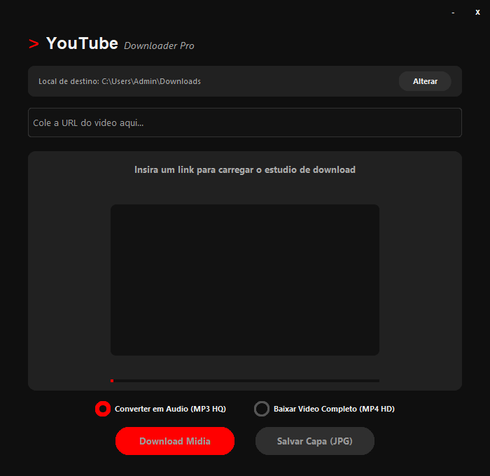

# YouTube Studio Downloader

Uma ferramenta desktop desenvolvida em Python para baixar vídeos, extrair áudios em alta qualidade (MP3) e salvar capas (thumbnails) de vídeos do YouTube através de uma interface gráfica minimalista e integrada.

<p align="center">
  
</p>

---

## Pré-requisitos

Antes de iniciar, você precisará instalar o Python e o gerenciador de pacotes no seu computador. Siga o passo a passo abaixo de acordo com o seu nível de experiência.

### 1. Instalando o Python 
1. Acesse o site oficial: https://www.python.org/downloads/
2. Clique no botão amarelo **Download Python** (recomenda-se a versão 3.10 ou superior).
3. **Muito Importante:** Na primeira tela do instalador, marque a caixa que diz **"Add Python to PATH"** antes de clicar em instalar. Se você não marcar essa opção, os comandos no terminal não funcionarão.
4. Siga as instruções da tela até concluir a instalação.

### 2. Instalando as Dependências
O programa utiliza três bibliotecas externas para funcionar (CustomTkinter para a interface gráfica, Pillow para processamento da imagem da capa, e yt-dlp para comunicação com o YouTube).

1. Abra o **Prompt de Comando** (digite `cmd` na barra de pesquisa do seu Windows e aperte Enter).
2. Cole o comando abaixo e aperte Enter:
   ```bash
   pip install customtkinter pillow yt-dlp

   Aguarde o término do carregamento. Uma mensagem de sucesso aparecerá quando finalizar.


Com o Python e as bibliotecas instaladas, siga estas etapas para executar a aplicação:

    Baixe os arquivos do projeto e coloque-os em uma pasta de sua preferência.

    Abra o Prompt de Comando (cmd).

    Navegue até a pasta onde o arquivo main.py está salvo utilizando o comando cd. Exemplo:
    Bash

    cd C:\Users\Admin\Documents\projetos\ytb-down (exemplo)

    Execute o programa com o interpretador Python digitando:
    Bash

    python main.py

    

Como Utilizar a Interface

O programa foi desenhado para ser autoexplicativo:

    Definir Destino: O programa salva os arquivos automaticamente na sua pasta padrão de Downloads do usuário. Caso queira mudar, clique no botão "Alterar" no topo direito.

    Inserir Link: Copie a URL do vídeo do YouTube que deseja baixar e cole no campo de texto central.

    Aguardar Sincronização: O programa buscará as informações do vídeo automaticamente. A barra vermelha começará a carregar e a capa do vídeo aparecerá na tela junto com o título oficial.

    Escolher Formato: Selecione se deseja salvar apenas o áudio convertido em MP3 ou o vídeo completo em MP4 utilizando as caixas de seleção.

    Baixar: Clique em "Download Midia" para iniciar o processo. Uma janela de aviso confirmará o término do download.


Este projeto foi idealizado e desenvolvido por DarlingSz.